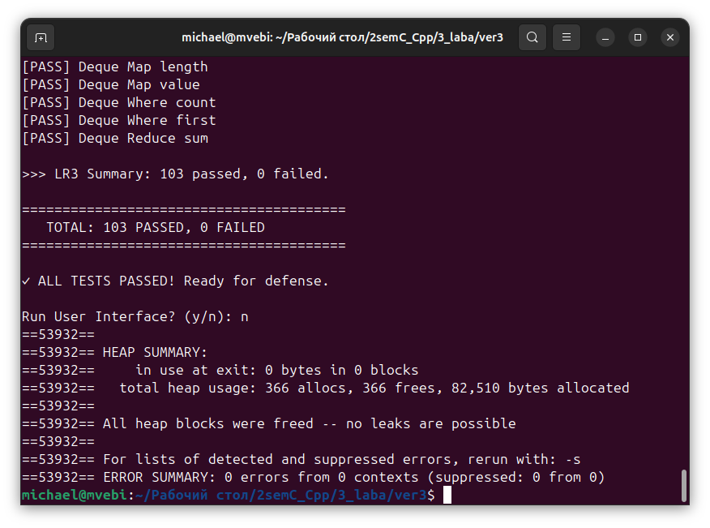
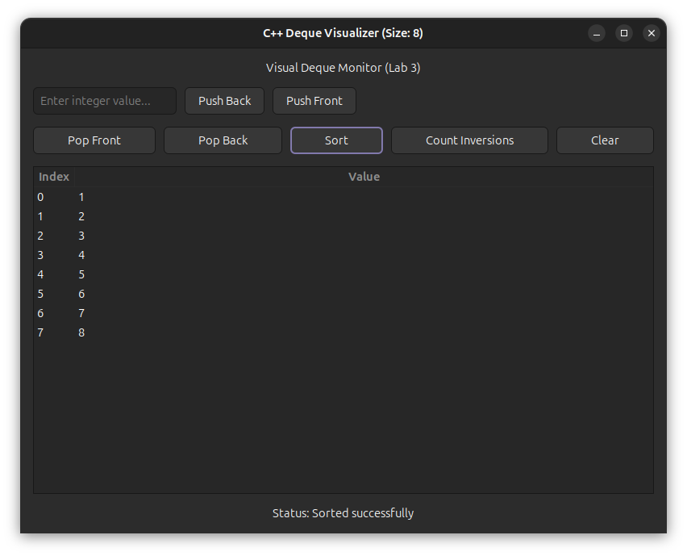

# 1 шаг  
Зависимости:  
`sudo apt install libgtk-3-dev`  
# 2 шаг
Собрать консольный интерфейс  
`g++ main.cpp -o lab3`  
Собрать gui  
`g++ maingui.cpp -o lab3_gui $(pkg-config gtkmm-3.0 --cflags --libs)`  
# 3 шаг  
Консольные тесты  
`./lab3`  
Графический интерфейс  
`./lab3_gui`  